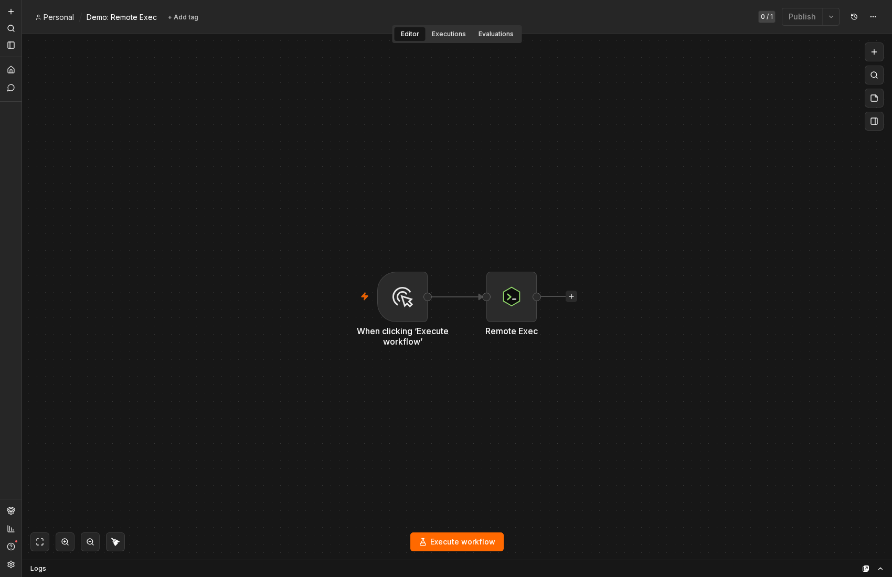
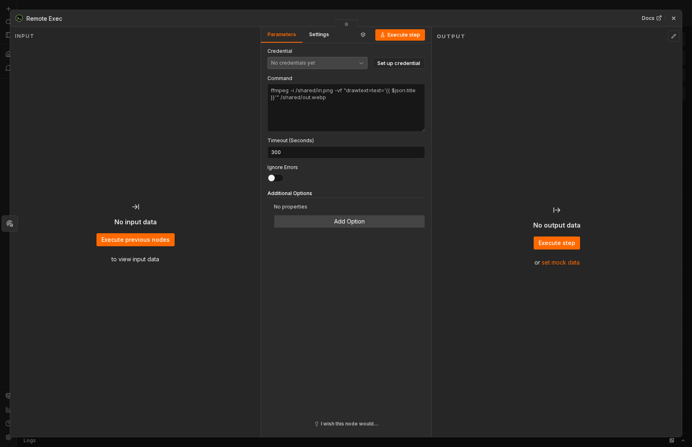
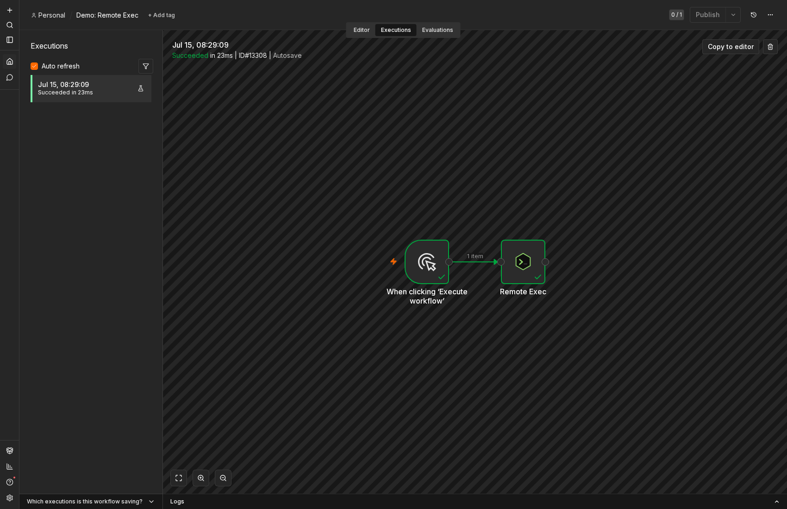
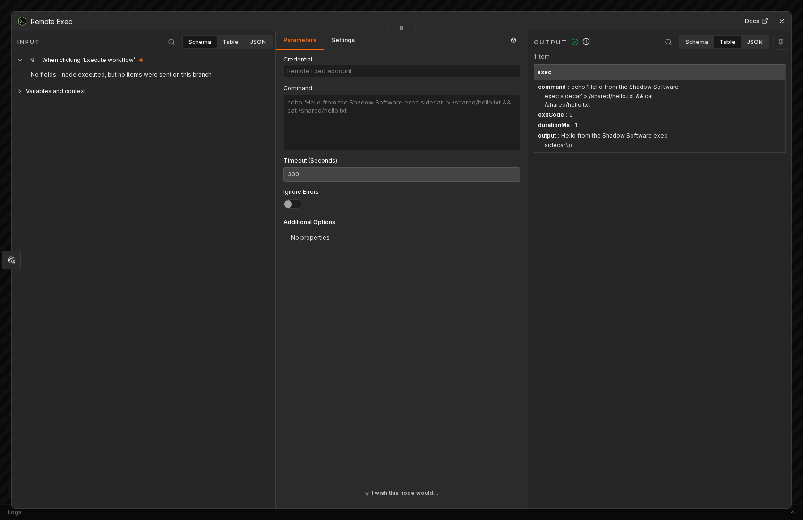

<p align="center">
  
</p>

<p align="center">
  <a href="https://www.npmjs.com/package/n8n-nodes-custom-exec"></a>
  <a href="LICENSE.md"></a>
  
  
</p>

# n8n-nodes-custom-exec

Run a command on a **remote execution service** from n8n, over HTTP.

Some jobs need a real shell and real tooling — `ffmpeg`, `imagemagick`, `pandoc`,
`yt-dlp`, a font stack — that the n8n image deliberately does not ship. The usual
answer is to stand up a small sidecar: an HTTP service that accepts a command,
runs it, and returns the result. This node is the n8n end of that arrangement. You
point it at your service with a credential, give it a command (n8n expressions and
all), and it hands back the exit code, output and duration.

The connection lives entirely on a **Remote Exec API** credential — base URL plus
an optional shared secret — so the node reads nothing from the environment. That is
both what n8n's node verification requires and what lets one n8n instance talk to
several exec services.

> Built and maintained by **[Shadow Software](https://shadowsoftware.com)** — we run
> n8n in production across a family of products and open-source the nodes we rely on.
> See our other node, **[n8n-nodes-huggingface-space](https://www.npmjs.com/package/n8n-nodes-huggingface-space)**,
> for running AI models from any Hugging Face Space.

[Installation](#installation) · [Credentials](#credentials) · [The exec service](#the-exec-service) · [Usage](#usage) · [Try it](#try-it--a-one-click-demo-workflow) · [Response](#response) · [Security](#security) · [Compatibility](#compatibility)

## Installation

Follow the [community nodes installation guide](https://docs.n8n.io/integrations/community-nodes/installation/),
then search for **`n8n-nodes-custom-exec`**.

Self-hosted, from the CLI:

```bash
npm install n8n-nodes-custom-exec
```

## Credentials

The node requires a **Remote Exec API** credential with two fields:

- **Base URL** — where your exec service lives, e.g. `http://exec-sidecar:8080`.
  Commands are POSTed to `{baseUrl}/exec`.
- **Token** *(optional)* — a shared secret. When set, it is sent as the
  `X-EXEC-TOKEN` header on every request; leave it empty if the service is
  unauthenticated.

The credential's **Test** button issues a `GET {baseUrl}/health`, so your service
should answer that path with a 200 for the test to pass. Testing never runs a
command.

## The exec service

The exec service is yours to run — the node is only the n8n client. Any HTTP server
works as long as it honours this tiny contract:

| Route | Purpose |
| --- | --- |
| `POST /exec` | body `{ "command": string, "timeout": number }` → `{ "exitCode": number, "stdout": string, "stderr": string, "durationMs": number }` |
| `GET /health` | `200` when healthy (used by the credential's **Test** button) |

A minimal reference implementation is a few dozen lines. For example, in Node:

```js
import express from 'express';
import { exec } from 'node:child_process';

const app = express();
app.use(express.json());
const TOKEN = process.env.EXEC_TOKEN; // set the same value on the credential

app.get('/health', (_req, res) => res.sendStatus(200));

app.post('/exec', (req, res) => {
  if (TOKEN && req.get('X-EXEC-TOKEN') !== TOKEN) return res.sendStatus(401);
  const { command, timeout = 300 } = req.body ?? {};
  const started = Date.now();
  exec(command, { timeout: Math.min(timeout, 1800) * 1000, maxBuffer: 64 << 20 },
    (err, stdout, stderr) => res.json({
      exitCode: err?.code ?? 0,
      stdout, stderr,
      durationMs: Date.now() - started,
    }));
});

app.listen(8080);
```

Run it in a container that has the tooling you need (`ffmpeg`, fonts, `imagemagick`,
…) alongside n8n, mount a shared volume into both, and point the credential at it.
Read the **[Security](#security)** section before you expose it anywhere.

## Usage

Set **Command** to whatever you want to run. n8n expressions are interpolated, so
you can build the command from earlier items:

```
ffmpeg -y -i /shared/{{ $json.inputFile }} \
  -vf "scale=1280:-1" /shared/{{ $json.outputFile }}
```

If both the exec service and n8n mount the same `/shared` volume at the same path,
files written by one are visible to the other, so a workflow can drop a file, run a
command against it, and pick the result back up.

- **Timeout (Seconds)** — the budget passed to the service. The node allows an
  extra 30 seconds on the HTTP call itself so a job that runs right up to its
  deadline still returns its result rather than being cut off in transit.
- **Ignore Errors** — when on, a non-zero exit is returned as data instead of
  failing the node.
- **Additional Options → Return Full Output** — return `stdout` and `stderr` as
  separate fields rather than a single `output` field.

## Try it — a one-click demo workflow

Every field below is set through the node's real UI. Wire a Manual Trigger into
Remote Exec, pick or create a **Remote Exec API** credential (Base URL + optional
Token), write a **Command**, click **Execute workflow**.

<p align="center"></p>
<p align="center"></p>
<p align="center"></p>
<p align="center"></p>

## Response

Each item gains an `exec` object:

```jsonc
{
  "exec": {
    "command": "ffmpeg -i /shared/in.png … /shared/out.webp",
    "exitCode": 0,
    "durationMs": 1834,
    "output": "…stdout…",     // single-field mode (default)
    "stderr": "…"             // present only when the command wrote to stderr
  }
}
```

With **Return Full Output** on, `output` is replaced by separate `stdout` and
`stderr` fields. The item's existing JSON is preserved alongside `exec`.

## Security

**This node runs arbitrary shell commands on whatever service the credential points
at.** Anyone who can edit the workflow can run any command that service allows,
with that service's privileges and filesystem access.

- Only point the credential at an exec service **you control**, on a network you
  trust — never a shared or public endpoint.
- Set a **Token** and have the service reject requests without a matching
  `X-EXEC-TOKEN`. Do not expose the service unauthenticated.
- Run the service with the least privilege it needs (a non-root user, a scoped
  volume, no host networking), and enforce your own timeout ceiling on its side —
  the client-supplied timeout is a request, not a guarantee.

Treat the exec service as a remote shell, because that is exactly what it is.

## Compatibility

- **n8n** 1.60.0 or later
- **Node.js** 20.15 or later

Tested against n8n 1.x.

### Dependencies

The node has **zero runtime dependencies** — nothing is shipped but the compiled
node itself, so a plain `npm audit --omit=dev` reports no vulnerabilities.

A plain `npm audit` does report advisories. Every one of them comes from
`n8n-workflow`, which is a **peer** dependency: n8n supplies it at runtime from its
own tree, so those advisories are resolved by upgrading n8n, not this package.

## Links

- **npm** — [n8n-nodes-custom-exec](https://www.npmjs.com/package/n8n-nodes-custom-exec)
- **Source** — [github.com/shadow-software/n8n-nodes-custom-exec-node](https://github.com/shadow-software/n8n-nodes-custom-exec-node)
- **n8n community nodes** — [installation & docs](https://docs.n8n.io/integrations/community-nodes/)
- **Also by us** — [n8n-nodes-huggingface-space](https://www.npmjs.com/package/n8n-nodes-huggingface-space): run image, video, music, speech, text and moderation models from any Hugging Face Space.

We also build and open-source a family of WordPress plugins and themes for
WooCommerce stores: [Broadside](https://github.com/shadow-software/broadside-theme-for-woocommerce)
(theme) and [Broadside Blocks](https://github.com/shadow-software/broadside-blocks-for-woocommerce),
[Crypto for WooCommerce](https://github.com/shadow-software/crypto-for-woocommerce), and
[AGT for WooCommerce](https://github.com/shadow-software/agt-for-woocommerce).

## About

Made by **[Shadow Software](https://shadowsoftware.com)** — we build and run
automation-heavy SaaS products and open-source the n8n nodes we depend on. If you
need custom n8n nodes, workflow automation, or a platform built around it, get in
touch at **[shadowsoftware.com](https://shadowsoftware.com)**.

## License

[MIT](LICENSE.md) © [Shadow Software](https://shadowsoftware.com)
